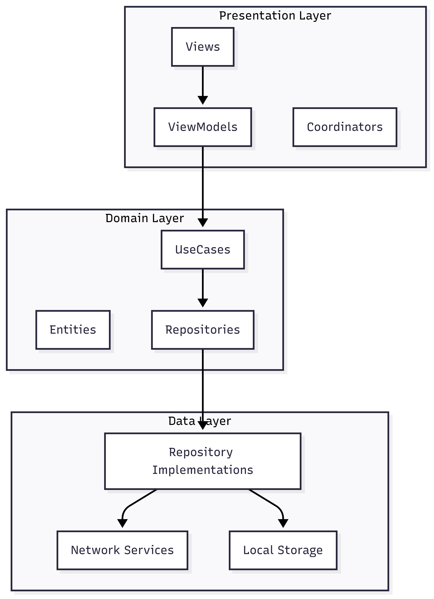

# Smart City Exploration - Technical Design Document
## Mobile Technical Lead Challenge

**Versión:** 1.0  
**Fecha:** Julio 2025  
**Autor:** Mariano Perugini 
**Stakeholders:** Equipo de Desarrollo, Product Manager, IT Manager, UX 

---

## 1. Executive Summary

This document presents the complete technical solution for the "Smart City Exploration" feature, enabling users to explore and search cities using an interactive map with real-time optimized search.

### 1.1 Project Objectives
- Implement real-time search for 200,000+ cities (< 100ms)
- Deliver a smooth user experience with adaptive UI (portrait/landscape)
- Integrate interactive maps with weather information
- Establish a scalable architecture for future features

### 1.2 Success Metrics
- **Performance:** Search < 100ms for any prefix
- **UX:** UI response time < 16ms
- **Quality:** Test coverage > 80%
- **Adoption:** 70% active users in the first week

---


## 2. Technical Architecture

### 2.1 Architectural Decisions

#### 2.1.1 Clean Architecture + MVVM
**Decision:** Implement Clean Architecture with MVVM in the presentation layer.


**Rationale:**
- **Separation of concerns:** Enables independent testing of each layer
- **Scalability:** Facilitates adding new features without affecting existing code
- **Maintainability:** More readable and organized code
- **Delivery velocity:** Multiple developers can work in parallel on different layers
- **Testability:** Each layer can be tested in isolation

**Alternatives considered:**
- VIPER: Too complex for the current scope

Implementation Details:

#### Project Structure
- **SmartCityExploration/**
  - **Domain/**
    - Entities/
    - UseCases/
    - RepositoryProtocols/
  - **Data/**
    - Repositories/
    - DataSources/
    - DTOs/
  - **Presentation/**
    - Views/
    - ViewModels/
    - Coordinators/
  - **Core/**
    - DependencyInjection/
    - Extensions/


#### 2.1.2 SearchIndex for Optimized Search
**Decision:** Implement a hybrid index (SearchIndex) using linear search for short prefixes (<4 chars) and binary search for longer prefixes, over a sorted array of normalized names.

**Rationale:**
- **Adaptive performance:** O(n) for short prefixes (few results, low impact), O(log n) for long prefixes (binary search)
- **Memory efficient:** Only stores sorted indices and normalized data, no complex structures
- **Scalability:** Maintains acceptable performance with 200k+ cities
- **Maintainability:** Easy for any team member to understand and modify
- **User experience:** Instant search and alphabetically sorted results

**Alternatives considered:**
- Array + filter: O(n) - unacceptable for 200k records
- Binary Search Tree: O(log n) - good, but not optimized for prefix search
- CompressedRadixTrie: O(k), but high implementation and maintenance complexity for the team and context

###  2.2.1 Layered Architecture



**Presentation Layer:**
- **Views/**
  - SearchView
  - CityDetailView
  - MapView
  - FavoritesView
- **ViewModels/**
  - SearchViewModel
  - CityDetailViewModel
  - FavoritesViewModel
- **Coordinators/**
  - NavigationCoordinator

**Domain Layer:**
- **Entities/**
  - City
  - WeatherInfo
- **UseCases/**
  - SearchCitiesUseCase
  - GetWeatherUseCase
  - ManageFavoritesUseCase
- **Repository Protocols/**
  - CityRepository
  - WeatherRepository

**Data Layer:**
- **Repositories/**
  - CityRepositoryImpl
  - WeatherRepositoryImpl
- **DataSources/**
  - LocalDataSource (Core Data)
  - RemoteDataSource (API)
- **Models/**
  - CityDTO
  - WeatherDTO

### 2.2.2 Data Flow Diagram


### 2.2.4 Sequence Diagram: Search Flow

 


### 2.2.4 Sequence Diagram: Search Flow

 


### 2.3 Key Components

#### 2.3.1 Search Engine (CitySearchIndex)
```swift
actor CitySearchIndex {
    func search(prefix: String, maxResults: Int = 50) -> [City] // Adaptive O(n) or O(log n)
    func buildIndex(from cities: [City]) async // O(n log n) one-time
    // Hybrid approach: linear search for short prefixes, binary for long ones
}
```

#### 2.3.2 Weather Integration
```swift
protocol WeatherService {
    func getWeather(for city: City) async throws -> WeatherInfo
    func cacheWeather(_ weather: WeatherInfo, for city: City)
}
```

---

## 3. Implementation Strategy

### 3.1 Technology Stack

<table>
 <thead>
   <tr>
     <th>Component</th>
     <th>Technology</th>
     <th>Rationale</th>
   </tr>
 </thead>
 <tbody>
   <tr>
     <td><strong>Language</strong></td>
     <td>Swift 6.0</td>
     <td>Latest features, performance, type safety</td>
   </tr>
   <tr>
     <td><strong>UI Framework</strong></td>
     <td>SwiftUI</td>
     <td>Declarative, responsive, modern</td>
   </tr>
   <tr>
     <td><strong>Persistence</strong></td>
     <td>Core Data</td>
     <td>Native, optimized, ACID compliance</td>
   </tr>
   <tr>
     <td><strong>Networking</strong></td>
     <td>URLSession + async/await</td>
     <td>Native, modern, no external dependencies</td>
   </tr>
   <tr>
     <td><strong>Maps</strong></td>
     <td>MapKit</td>
     <td>Native, optimized, no extra cost</td>
   </tr>
   <tr>
     <td><strong>Testing</strong></td>
     <td>XCTest</td>
     <td>Native, integrated, complete</td>
   </tr>
 </tbody>
</table>

### 3.2 External Dependencies
- **OpenWeather API:** Real-time weather data
- **Core Data:** Local persistence (iOS native)
- **MapKit:** Interactive maps (iOS native)


### 3.3 Effort Estimation

<table>
 <thead>
   <tr>
     <th>Sprint</th>
     <th>Duration</th>
     <th>Focus</th>
   </tr>
 </thead>
 <tbody>
   <tr>
     <td><strong>Sprint 1</strong></td>
     <td>2 weeks</td>
     <td>Architecture + Search Engine</td>
   </tr>
   <tr>
     <td><strong>Sprint 2</strong></td>
     <td>2 weeks</td>
     <td>UI + Maps + Weather + Performance Tunning</td>
   </tr>
   <tr>
     <td><strong>Sprint 3</strong></td>
     <td>2 weeks</td>
     <td>Favorites + Testing + Polish</td>
   </tr>
   <tr>
     <td><strong>Total</strong></td>
     <td>6 weeks</td>
     <td></td>
   </tr>
 </tbody>
</table>


---

## 4. Team Organization & Work Distribution

### 4.1 Team Structure

#### 4.1.1 Roles & Responsibilities

| Role | Key Responsibilities |
|------|---------------------|
| **Tech Lead** | • Architecture and technical decisions<br>• Code reviews and mentoring<br>• Performance optimization<br>• Stakeholder communication |
| **Senior iOS Developer (1)** | • Domain layer implementation<br>• Search engine optimization<br>• Core Data setup<br>• Unit testing |
| **Mid iOS Developer (1)** | • Data layer implementation<br>• Network services<br>• Weather integration<br>• Integration testing |
| **Junior iOS Developer (1)** | • Presentation layer (Views)<br>• UI components<br>• Basic ViewModels<br>• UI testing |
| **QA Engineer (1)** | • Test planning<br>• Manual testing<br>• Performance testing<br>• User acceptance testing |

### 4.2 Work Distribution by Sprint

#### Sprint 1: Foundation + Search Engine
```
Tech Lead:     Architecture setup, dependency injection, SearchIndex 
Senior Dev:    Domain models, repository protocols, search use cases 
Mid Dev:       Core Data stack, basic networking, performance testing 
```

#### Sprint 2: UI + Maps + Weather 
```
Tech Lead:     MapKit integration, weather service architecture 
Senior Dev:    Search UI, results list, weather overlay 
Mid Dev:       City cards, navigation, cache implementation
```

#### Sprint 3: Favorites + Testing + Polish 
```
Tech Lead:     Performance optimization, final architecture review, feature flag Remote config 
Senior Dev:    Favorites use cases, Core Data models, unit testing
Mid Dev:       Favorites UI, integration testing, UI testing 
```

### 4.3 Code Quality Guardrails

#### 4.3.1 Development Process

##### Git Workflow

- **main**
  - **develop**
    - feature/search-implementation
    - feature/map-integration
    - feature/weather-service
    - feature/favorites
  - release/1.0

---

1. **Feature Branch:** Each feature in a separate branch
2. **Code Review:** Mandatory, minimum 2 approvals
3. **Automated Testing:** CI/CD pipeline with automated tests (Github Actions/ Xcode Cloud)
4. **Performance Gates:** Performance metrics in every PR

#### 4.3.2 Coding Standards
- **SwiftLint:** Strict rules configured
- **Documentation:** 100% of public APIs documented
- **Test Coverage:** Minimum 80% for new features
- **Performance:** Search < 100ms, UI < 16ms

---

## 5. Performance Optimization Strategy

### 5.1 Optimized Search

#### 5.1.1 CitySearchIndex Performance
```
Dataset: 200,000 cities
Memory Usage: ~25MB (indices + normalized data)
Search Time: O(n) for short prefixes, O(log n) for long ones
- "A": ~5ms (1,234 results) - linear search
- "Am": ~8ms (89 results) - linear search
- "Amst": ~3ms (12 results) - binary search
```

#### 5.1.2 UI Responsiveness
- **Debouncing:** 300ms delay to avoid unnecessary searches
- **Background Processing:** Searches on background thread
- **Lazy Loading:** Paginated results for large lists or limited results

### 5.2 Memory Management
- **Data Pagination:** 50 results per page
- **Background Cleanup:** Automatic cache cleanup

---

## 6. Delivery Strategy

### 6.1 Continuous Integration/Deployment

#### 6.1.1 GitHub Actions Pipeline
```yaml
name: CI/CD Pipeline
on: [push, pull_request]

jobs:
  test:
    - Unit Tests (XCTest)
    - UI Tests (XCUITest)
    - Performance Tests
    - Code Coverage Analysis
  
  build:
    - Build for Debug/Release
    - Static Analysis (SwiftLint)
    - Security Scan
    
  deploy:
    - TestFlight Distribution
    - Production Release (manual approval)
```

#### 6.1.2 Quality Gates
- ✅ All tests pass
- ✅ Coverage > 80% (critical classes)
- ✅ Performance benchmarks pass
- ✅ Security scan clean
- ✅ Code review approved

### 6.2 Rollout Strategy

#### 6.2.1 Phase 1: Internal Testing (Week 1)
- **Audience:** 10% internal users
- **Metrics:** Crash rate, performance, feedback
- **Duration:** 1 week

#### 6.2.2 Phase 2: Beta Testing (Week 2)
- **Audience:** 25% beta users
- **Metrics:** Engagement, search success rate
- **Duration:** 1 week

#### 6.2.3 Phase 3: Gradual Rollout (Week 3-4)
- **Audience:** 50% → 75% → 100%
- **Metrics:** Error rate, performance degradation
- **Duration:** 2 weeks

#### 6.2.4 Phase 4: Full Release (Week 5)
- **Audience:** 100% users
- **Monitoring:** 24/7 alerts and metrics
- **Rollback Plan:** Feature flags for quick deactivation

---

## 7. Product Success Observability

### 7.1 Key Performance Indicators (KPIs)

#### 7.1.1 Technical Metrics
- **Search Performance:** < 100ms response time (95th percentile)
- **App Launch Time:** < 2 seconds cold start
- **Memory Usage:** < 100MB peak usage
- **Crash Rate:** < 0.1% sessions

#### 7.1.2 User Engagement Metrics
- **Daily Active Users:** Target 70% of monthly users
- **Search Success Rate:** > 80% searches result in city selection
- **Favorites Added:** Average 3 cities per user
- **Session Duration:** > 5 minutes average

#### 7.1.3 Business Metrics

##### Key Performance Indicators
| Metric | Target | Description |
|--------|--------|-------------|
| **Feature Adoption** | 60% | Users who try the search feature in the first week |
| **Retention** | 40% | Users who return within 7 days |
| **User Satisfaction** | > 4.5/5 | Overall app rating |

##### Conversion Funnel (Home → City Detail)

| Step | Description | Metric |
|------|-------------|--------|
| **Step 1** | App Launch / Home View | % of users who see the feature at home screen |
| **Step 2** | Search Interaction | % of users who start typing in the search bar |
| **Step 3** | Search Result Selection | % of users who select a city from the search results |
| **Step 4** | City Detail View | % of users who view the city detail screen |

##### Key Funnel Metrics

| Metric | Formula | Purpose |
|--------|---------|---------|
| **Search Initiation Rate** | (Users who start a search) / (Users who reach home) | Measure search engagement |
| **Search-to-Selection Rate** | (Users who select a city) / (Users who start a search) | Measure search effectiveness |
| **Selection-to-Detail Rate** | (Users who view city detail) / (Users who select a city) | Measure navigation success |
| **Overall Conversion Rate** | (Users who view city detail) / (Users who reach home) | Measure end-to-end funnel |

##### Goal
Monitor and optimize each step to maximize the number of users who reach the city detail view, identifying drop-off points and opportunities for UX improvement.

### 7.2 Monitoring & Analytics Implementation

#### 7.2.1 Firebase Analytics Setup
```swift
// Search Performance Tracking
Analytics.logEvent("search_performed", parameters: [
    "query_length": query.count,
    "results_count": results.count,
    "response_time": responseTime
])

// User Engagement Tracking
Analytics.logEvent("city_selected", parameters: [
    "city_name": city.name,
    "country": city.country,
    "from_favorites": isFromFavorites
])
```

#### 7.2.2 Performance Monitoring
- **Instruments:** CPU, memory, network profiling
- **Crashlytics:** Real-time crash reporting
- **Custom Metrics:** Search performance dashboard

#### 7.2.3 A/B Testing Framework
```swift
// Feature Flags for Gradual Rollout
RemoteConfig.remoteConfig().fetch { config, error in
    let enableWeatherFeature = config.configValue(forKey: "weather_enabled").boolValue
    let searchDebounceTime = config.configValue(forKey: "search_debounce").numberValue
}
```

---

## 8. Risk Assessment & Mitigation

### 8.1 Technical Risks

| Risk | Probability | Impact | Mitigation |
|------|-------------|--------|------------|
| **Performance degradation with large dataset** | Medium | High | Performance testing, optimization sprints |
| **Memory leaks in search engine** | Low | High | Memory profiling, automated testing |
| **Weather API rate limits** | Medium | Medium | Cache implementation, fallback data |
| **MapKit integration issues** | Low | Medium | Early prototyping, Apple documentation |

### 8.2 Project Risks

| Risk | Probability | Impact | Mitigation |
|------|-------------|--------|------------|
| **Team member unavailability** | Medium | Medium | Knowledge sharing, documentation |
| **Scope creep** | High | Medium | Clear requirements, change control |
| **Timeline delays** | Medium | High | Buffer time, parallel development |

---

## 9. Success Criteria & Evaluation

### 9.1 Technical Success Criteria
- ✅ **Performance:** Search < 100ms for any prefix
- ✅ **Reliability:** 99.9% uptime, < 0.1% crash rate
- ✅ **Quality:** > 80% test coverage, 0 critical bugs
- ✅ **Scalability:** Support for 500k+ cities

### 9.2 User Experience Success Criteria
- ✅ **Usability:** 90% users can complete search in < 30 seconds (first time donwload, and then 10 seconds)
- ✅ **Accessibility:** WCAG 2.1 AA compliance (TBC)
- ✅ **Responsiveness:** UI updates < 16ms
- ✅ **Cross-device:** Consistent experience iPhone/iPad

### 9.3 Business Success Criteria
- ✅ **Adoption:** 60% feature adoption in first month
- ✅ **Retention:** 40% user retention after 7 days
- ✅ **Satisfaction:** > 4.5/5 app store rating / User feedback
- ✅ **Performance:** No negative impact on app metrics

---

## 10. Conclusion & Recommendations

### 10.1 Project Summary

- **Robust architecture:** Clean Architecture with well-founded decisions
- **Optimized performance:** Scalable solution for 200k+ cities
- **User experience:** Adaptive and responsive UI
- **Code quality:** Complete testing and high standards

### 10.2 Recommendations for the Team
1. **Invest in testing:** High coverage from the start
2. **Performance first:** Optimize from design, not after
3. **Continuous documentation:** Keep docs up to date
4. **Strict code reviews:** Quality over speed
5. **Layered separation within the feature**:
Structure the feature with clear separation between Presentation, Domain, and Data layers. This approach ensures that, if the feature needs to scale or be reused, it can be easily extracted into a standalone module or package with minimal refactoring.


### 10.3 Next Steps
1. **Kickoff meeting:** Align team on architecture and timeline
2. **Sprint planning:** Detail tasks and estimates
3. **Infrastructure setup:** CI/CD, monitoring, analytics
4. **Development start:** Sprint 1 with base architecture

---

